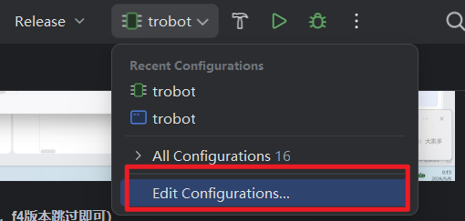
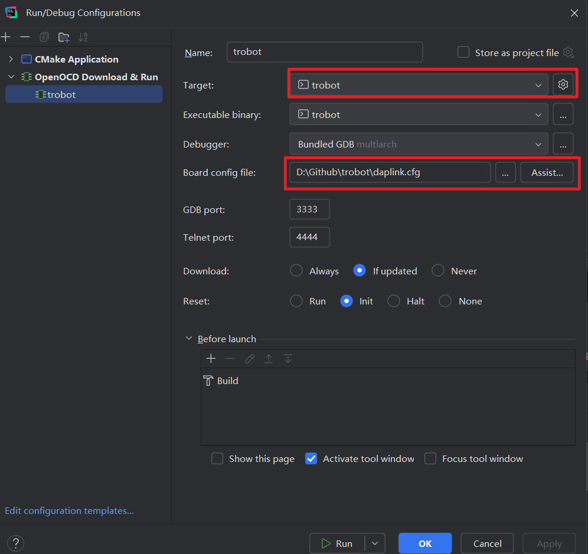

## TRobot

**T**GU **R**obot: The next robot embedded development framework.

### 快速开始

#### step1. 克隆项目代码

```shell
git clone https://github.com/lym12321/trobot.git --recursive
```

> [!IMPORTANT]
> 此处在执行 `git clone` 命令时，应当添加 `--recursive` 参数。

#### step2. 使用 STM32CubeMX 生成代码

使用 STM32CubeMX 打开 `.ioc` 文件，点击 `GENERATE CODE` 按钮生成代码。

#### step3. 在 CLion 中打开项目文件夹并配置 CMake 预设

1. 取消勾选默认配置文件的 `Enable profile` 
2. 选择带有 `preset` 标识的预设配置（一般用 `Debug preset`）
3. 勾选新配置文件的 `Enable profile`

<div align="center"></div>

#### step4. 回滚 `.ld` 文件

由于 STM32CubeMX 生成的 `.ld` 文件会覆盖原有文件，因此需要将其回滚到最初的版本。
<div align="center"></div>

#### step5. 编译烧录

配置 OpenOCD，编译并烧录代码。

1. 添加 `OpenOCD Download & Run`

<div align="center"></div>

<div align="center"></div>

2. 在 OpenOCD 配置界面选择 trobot 和你使用的烧录配置 `.cfg` 文件

<div align="center"></div>

点击绿色小三角编译并烧录程序，确认烧录成功且开发板上的 LED 灯可以正常闪烁。

> [!CAUTION]
> - 该项目仍在开发中，尚未完成，部分功能可能无法使用。
> - 此版本相对于前期项目有较大改动，请确保在完全理解项目代码逻辑后使用，**不要**直接复制旧代码的参数和逻辑。

### 可选组件

> [!TIP]
> - 这部分是可选的 components，可以根据实际需求选择安装。
> - 每个组件给出了对应的安装命令，可复制后在项目根目录执行。

#### RoboMaster 裁判系统通信组件

<https://github.com/lym12321/tr_comp_robomaster>

```shell
git submodule add -f https://github.com/lym12321/tr_comp_robomaster.git components/robomaster
```